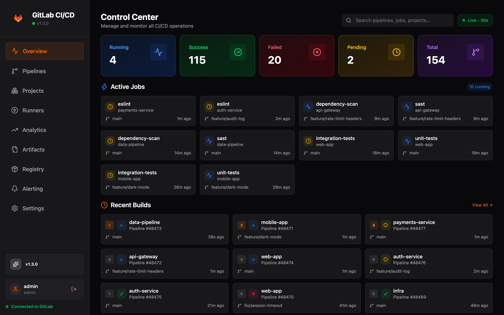

<div align="center">


# GitLab CI/CD Dashboard

Self-hosted dashboard for GitLab CI/CD pipelines, jobs, runners, artifacts and alerts.

[](https://github.com/ismoilovdevml/gitlab-ci-dashboard/actions/workflows/main.yml)
[](LICENSE)
[](https://hub.docker.com/r/ismoilovdevml/gitlab-ci-dashboard)

**[Documentation](https://ismoilovdevml.github.io/gitlab-ci-dashboard/)**

</div>



- Pipelines, active jobs and job logs (colours, collapsible sections) from all your projects, with retry and cancel
- DORA metrics and trends from production deployments or default-branch pipelines
- Runners, artifacts and container registry tags, with download and cleanup
- GitLab webhook events forwarded to Slack, Telegram or Discord, with a delivery history

Runs on your server with Docker Compose and works with GitLab.com and self-managed GitLab. The
GitLab token is encrypted and never reaches the browser. MIT licensed, no feature limits.

## Quick start

Requires Docker Engine with the Compose plugin and `curl`.

```bash
curl -fsSL https://raw.githubusercontent.com/ismoilovdevml/gitlab-ci-dashboard/main/scripts/install.sh | bash
```

The installer generates `.env` with random secrets, starts the stack and prints the URL and the
admin password. Open the dashboard, go to **Settings** and connect GitLab with an access token
(`read_api` scope for read-only use).

Installer options, manual Docker Compose setup, configuration, HTTPS, backups and upgrades are in
the [documentation](https://ismoilovdevml.github.io/gitlab-ci-dashboard/):

- [Getting started](https://ismoilovdevml.github.io/gitlab-ci-dashboard/guide/getting-started)
- [Configuration](https://ismoilovdevml.github.io/gitlab-ci-dashboard/guide/configuration)
- [Deployment](https://ismoilovdevml.github.io/gitlab-ci-dashboard/guide/deployment)
- [Troubleshooting](https://ismoilovdevml.github.io/gitlab-ci-dashboard/guide/troubleshooting)

## Contributing

See [CONTRIBUTING.md](CONTRIBUTING.md) for the development setup and the pull request process.

## Security

Report vulnerabilities privately as described in [SECURITY.md](SECURITY.md).

## License

[MIT](LICENSE)
